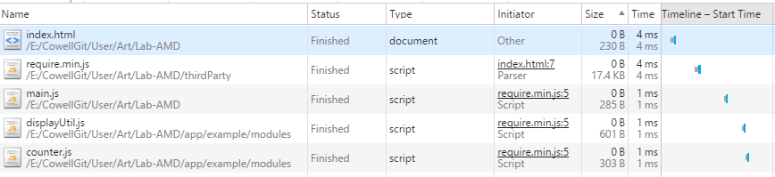

##  範例來源
* 章節：3.4 模組加載及依賴管理
* 書籍：SPA設計與架構 理解單頁面web應用

---

## RequireJS 實踐 AMD
模組文件用到的`<Script>`標籤會產生阻斷，瀏覽器在載入時應用程序將會暫停。  
因此，模組文件數越多，等待加載的時間就越長  

透過`<script>`標籤的`defer`和`async`屬性，HTML為了JavaScript代碼的加載和執行，提供了原生的支持。  

`defer`屬性表示script在頁面完成解析之後才執行  
`async`屬性則只要腳本可用，就非同步執行  
使用`<script>`標籤時，由開發者確保script的正確順序以便依賴在需要的時候可用

所以要開發者自己去管理模組之間的相互依賴關係來決定script的先後載入順序？
別鬧了吧!!

---
## 透過腳本加載器來解決此一問題
AMD腳本加載器用來確保程式在執行之前，所有的依賴模組都會先被載入   
大多數的腳本加載器也都能夠緩存模組，無論請求有多少次，模組都只需要加載一次  

AMD定義兩種結構：
1. `define`：宣告一個模組，類似先前使用模組模式那樣
2. `require`：用來非同步取得指定的模組，在此結構中，定義加載模組的方式與`define`語法相同；當依賴模組取得完畢之後，執行回調函數

## RequireJS AMD 範例 ##
1. 透過RequireJS管理模組，於主要頁面`index.html`當中載入requireJS，並給予程式進入點`main.js`
2. 於`main.js`當中進行requireJS的設定需要被管理的模組、自定義的模組名稱以及程式實際路徑
3. 於`main.js`執行util模組內的方法，並注意到程式中宣告了依賴util模組，所以可以執行所依賴模組的方法
4. 實際上在`util`模組內，又宣告了依賴於`counter`模組，所以`util`也可以使用`counter`的方法

實際上可看見瀏覽器的執行順序
1. 載入`html`
2. 載入`requireJS`
3. 載入我們指定的程式進入點`main.js`
4. 依據`main.js`設定的依賴模組，載入`util`模組
5. 因為`util`模組依賴於`counter`模組，因此接著載入`counter.js`